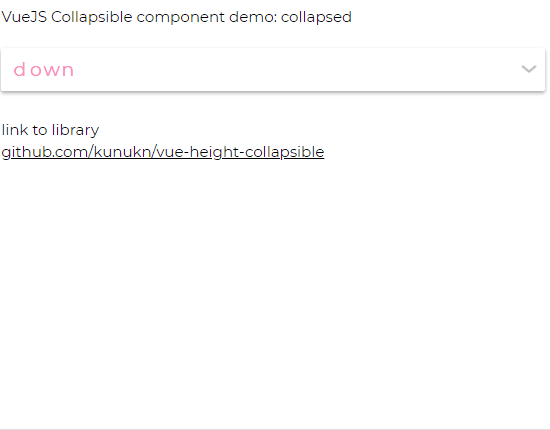

# Vue HeightCollapsible

Collapsible component with CSS transition for elements with variable and dynamic height.

[](https://www.npmjs.com/package/vue-height-collapsible)
[](https://www.npmjs.com/package/vue-height-collapsible)
[](https://bundlephobia.com/result?p=vue-height-collapsible)
[](https://github.com/kunukn/vue-height-collapsible/blob/master/LICENSE)

Vue HeightCollapsible


## Demo



- simple view https://ooisb.csb.app/

- simple edit https://codesandbox.io/s/vue-height-collapsible-demo-ooisb

- view multiple https://y2jjy.csb.app

- edit multiple https://codesandbox.io/s/vue-height-collapsible-demo-y2jjy

## Supported versions

### Vue 2 and Vue 3

```bash
npm install vue-height-collapsible
// or yarn install vue-height-collapsible
```

### Vue 2

```vue
import HeightCollapsible from "vue-height-collapsible";
```

### Vue 3

```vue
import HeightCollapsible from "vue-height-collapsible/vue3";
```

### Alternative approach

The source file could be copied. It is only this file.<br/>
`vue-height-collapsible.vue`

## Usage example

### Simple

```vue
<template>
  <div class="my-component">
    <button @click="isOpen = !isOpen">
      Toggle
    </button>
    <HeightCollapsible :isOpen="isOpen">
      <p>Paragraph of text.</p>
      <p>Another paragraph is also OK.</p>
    </HeightCollapsible>
  </div>
</template>

<script>
import HeightCollapsible from "vue-height-collapsible";

export default {
  name: "MyComponent",
  components: {
    HeightCollapsible,
  },
  data() {
    return {
      isOpen: true,
    };
  },
};
</script>
```

### Using Aria and scoped slots

```vue
<template>
  <div class="my-component">
    <button
      @click="isOpen = !isOpen"
      :aria-expanded="isOpen"
      aria-controls="my-collapsible-1"
    >
      <span>Toggle {{ collapseState }}</span>
    </button>
    <HeightCollapsible
      :isOpen="isOpen"
      @update="onUpdate"
      v-slot="{ state }"
      id="my-collapsible-1"
    >
      <p>I know the collapse state: {{ state }}</p>
      <p>Paragraph of text.</p>
      <p>Another paragraph is also OK.</p>
      <p>Images and any other content are ok too.</p>
    </HeightCollapsible>
  </div>
</template>

<script>
import HeightCollapsible from "vue-height-collapsible";

export default {
  name: "MyComponent",
  components: {
    HeightCollapsible,
  },
  data() {
    return {
      isOpen: true,
      collapseState: "",
    };
  },
  methods: {
    onUpdate({ state }) {
      this.collapseState = state;
    },
  },
};
</script>
```

## Properties

| Prop               | Type    | Default |
| ------------------ | ------- | ------- |
| isOpen             | boolean | true    |
| transition         | string  |         |
| tag                | string  | div     |
| overflowOnExpanded | boolean | false   |

<br/>

#### `isOpen` : boolean

Expands or collapses content.

#### `transition` : string

You can also specify a CSS transition inline by using the `transition` prop.

```html
<HeightCollapsible
  transition="height 300ms cubic-bezier(.4, 0, .2, 1)"
  :isOpen="isOpen"
>
  <p>Paragraph of text</p>
</HeightCollapsible>
```

#### `tag` : string

You can specify the HTML element type for the collapse component. By default the element type is a `div` element.

```html
<HeightCollapsible tag="article" :isOpen="isOpen">
  <p>Paragraph of text</p>
</HeightCollapsible>
```

#### `overflowOnExpanded` : boolean

If added, then `overflow: hidden` inline style will not be added when the state is `expanded`.

<br>

# npm

https://www.npmjs.com/package/vue-height-collapsible

# CDN files

To see all the available CDN files go to
https://unpkg.com/browse/vue-height-collapsible/

# Design goals

- let the browser handle the animation using CSS height transition
- minimal in file size
- minimalistic API - only have a Collapsible component which updates on isOpen props
- flexible - provide your own markup, styling and easing
- interruptible - can be reversed during movement
- inert - when collapsed you should tab over the collapsed component
- availability - from cdn or npm install, commonjs, minified or ES module
- collapsible on height only

# This was created with heavy inspiration from

https://github.com/kunukn/react-collapse


# Development

The compiler in this repository works for Vue 2 version.<br/>
This library was created using https://github.com/team-innovation/vue-sfc-rollup
